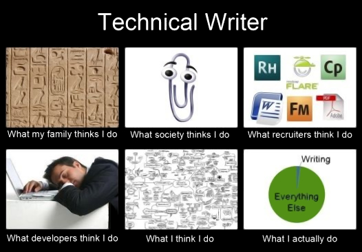

## What does a technical writer do?

### Isn't it ironic?

You would probably expect a technical writer to... write, or at least have most of their tasks involve writing. Here comes the surprise. In reality, much of a technical writer's work may not consist in writing at all. It can be editing texts. It can be gathering and synthesizing data. It can be maintaining and reusing content. It can even be writing some code, but not necessarily writing in human-readable language. This, of course, will differ from job to job, sometimes dramatically. Unfortunately, the obscurity is here to stay until everyone agrees on what technical writing actually is – and that doesn't seem to be coming anytime soon.  

  
*Pretty much this.* | Image source: [Technical Writer in China](https://twchina.wordpress.com/technical-writers-who-are-they/)  

### High- and low-level operations

The level of technicality of a technical writer's job could be represented by a hypothetical vertical scale of the *level* of operations the job involves.

A lower-level operation would be any operation that concerns more specific elements of a system; one that requires deeper technical knowledge and a direct intervention in a product. This could be, for example, implementing something in the software's code; especially some functionality, automation, or anything deeper, in terms of logic, than mere presentational aspects.

A higher-level operation, on the other hand, would be any operation that concerns more general functioning of a system; one that requires less technical knowledge. This could be, for instance, writing a description of software or release notes, after prior discussion with developers and user-side experience with a program.  

On this spectrum, different technical writing posts can vary greatly in responsibilities. Some tech writers might be part of a [Scrum](../../09-glossary/index.md/#s) team, for example, and on certain days contribute to the code on par with other developers, while for the rest of the week they deal mostly with documents. Others can have much of their workload include testing, graphic design, [UX writing](../../04-learning-the-basics/3-content-design/index.md/#user-experience), managing content in specialized [publishing software](../../05-tools/2-content-management-and-publishing/index.md), taking screenshots, editing videos, and so on. Some may deal only with high-level operations such as writing tutorials or quick start guides for non-technical end users.  

### The common denominator

No matter how much jobs in the field may vary, the core of technical writing remains the same: to act as an intermediary between technical and non-technical individuals and as a communicator within each of these groups.

  

In this communication, creating, editing, maintaining, testing, and analyzing the content is either the result, the cause, or the means – and most likely all of these, at different points.  

Thus, there are writers who take lower-level, technical input, and transform it into easy-to-understand output for non-technical users: manuals, tutorials, and the like. There are also writers who create content for developers and engineers: specifications, implementation guides, or [API](../../09-glossary/index.md/#a) documents, among others. Finally, there are writers who create content that helps with management, efficiency, and safety within an organization: rules, guidelines, policies, or various process documentation.  

The last example hints at the main goals of technical writing: efficiency, facilitation, and standardization; that is to instruct, to explain, to clarify, and to organize. The focus is what sets this profession apart from other writing jobs, such as: 

* Creative writing[^1], which concentrates on aesthetics and entertainment value.
* Marketing writing and copywriting, focusing on sales and performed for business purposes.
* Academic writing, which consists in presenting ideas, synthesizing knowledge, and engaging in scholarly discussions.
* UX writing, with the goal to build intuitive interfaces.

Of course, these professions may sometimes overlap, but in general, the context, the standards, the tools – and the resulting workflow – are different enough in the long run to tell one type of writing from another.  

Technical writers must be great investigators, but they also need good social skills; their research – unlike that of some scholars or creative writers – can hardly be performed alone.  

### Work environment

If you ever got tired with your field's inclination toward freelancing and side projects, you can take solace in the fact that technical writers generally work under one employer: either full-time or as B2B contractors.  

Remote work is also very common, although this will vary depending on the company as well as the product. Software documentation fits into the home-office pattern well, but for hardware you might have to be present on site to get hands-on experience with the product.  

[^1]: This is not to say that technical writing *isn't* or *can't be* creative.

---

* Footnotes will be placed here.
{:footnotes}  

---

*Next topic: [What are the career prospects](../3-what-are-the-career-prospects/)*