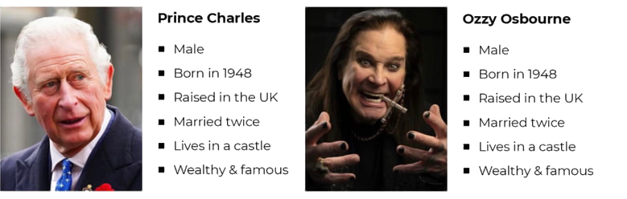
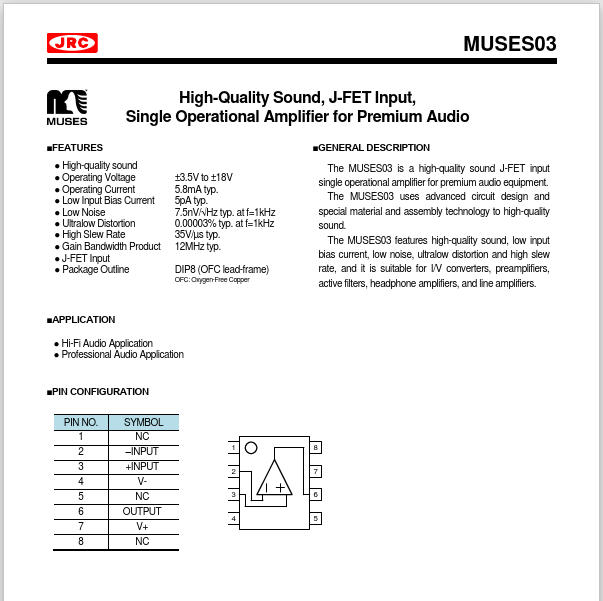
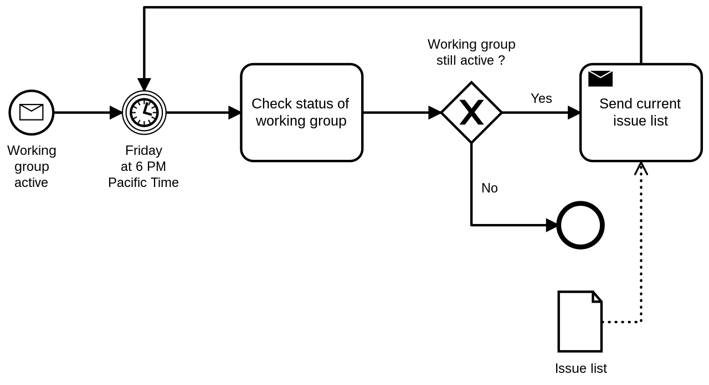
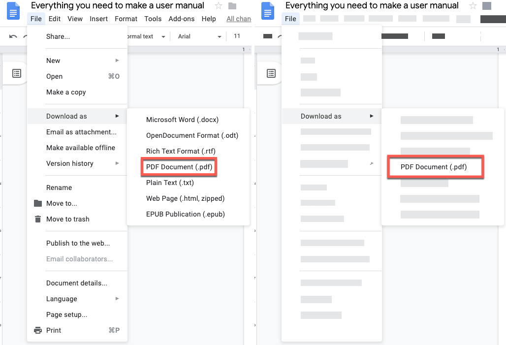
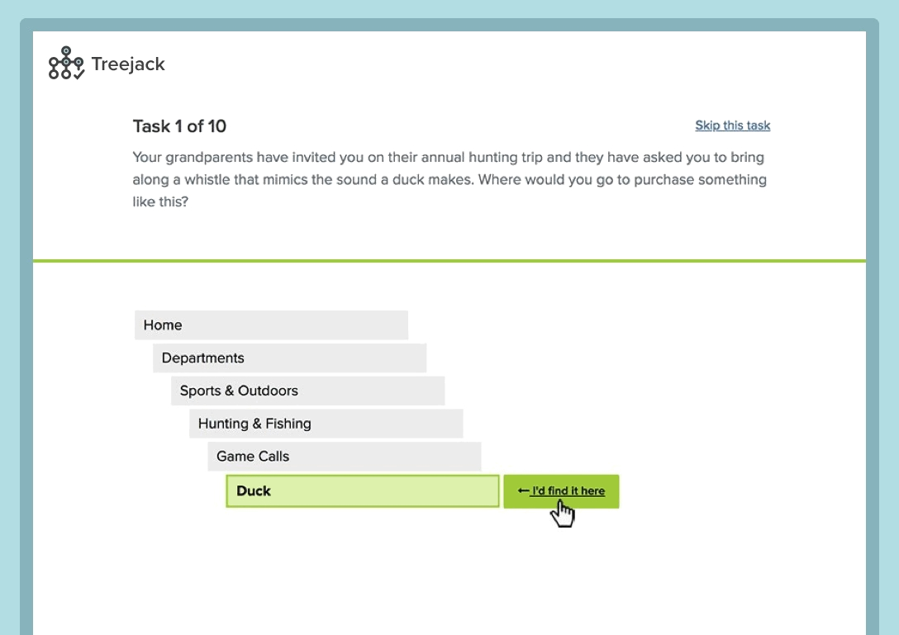

## Content design

[Persona⎹](#persona) [STE and Plain English⎹](#ste-and-plain-english) [Information architecture⎹](#information-architecture) [Graphic design⎹](#graphic-design) [User experience⎹](#user-experience) [Accessibility⎹](#accessibility) [Testing](#testing)

---

### Persona

In technical writing, like in translation, you need to mind your audience. Custom-tailored documents are more effective; they save a lot of time and resources. This works on both ends: your readers get content that suits their needs, and you have an easier task planning the scope of the project. Just think how much bigger this guide would be if I had to include sections on CAT tools and localization. *Oof...* You bet I would have picked another topic. ☺  

To better picture project requirements, technical writers prepare personas – fictional profiles with features that represent some key characteristics (e.g., level of knowledge, social group, age) of the target audience. A persona should be realistic and based on market research, customer feedback, project goals, use cases, and other available data.  

  
*Make sure your persona's features are relevant.* | Image source: [Turtle.co](https://turtl.co/blog/behavioral-insights-meme-breakdown/)

A persona should help you specify what information to include in a document and how to adjust your language to your target audience. The key points to identify are:  

* How much do they know about the product?
* How do they use the product?
* What are their needs?
* How do they use documentation? 

Let's take, for example, documentation for headphone amplifiers. A user guide would include a short description of what the device does (and, in the marketing fashion, why buying it was *the best decision*), how it's used, and what the basic specs are.  

On the other hand, an enthusiast who modifies amplifiers would be better off with something like this:  

  

I don't think we need to add *"the green LED indicates your device is on"* here.

Personas can vary a lot. Gamers prefer on-screen instructions to PDFs. Senior users might choose printed media over online help. A construction worker may need a leaflet to hold in one hand. There are plenty of factors that influence the shape of your document.  

### STE and Plain English

As a translator, you know that technical texts favor simplicity. Instructions should be clear, concise, and written in plain language – lest you misconnect a wire and cause some tragedy.  

[ASD-STE100](https://asd-ste100.org/), or Simplified Technical Language, goes a little further than dreading the *Past Perfect*. It is a controlled language created specifically to provide clarity and reduce ambiguity in technical texts. STE is maintained and developed by the Simplified Technical English Maintenance Group (STEMG).

STE has very specific rules regarding grammar and vocabulary. Polysemous words have one approved meaning, there are no phrasal verbs, and certain words are limited to only one part of speech. For example, *acceptance* is not permitted; you rephrase your sentences to use the verb *accept* instead. For detailed instructions, check out the latest issue of [STE specification](https://asd-ste100.org/request.html).  

Not every company uses STE, and learning it won't cost you sleepless nights; still, it's worth knowing it exists. If you ever happen to write in STE, don't underestimate it. It's a controlled standard, so proficiency in English gives you little advantage here.  

### Information architecture

| 👤 USERS | 📄 CONTENT | ❔ CONTEXT |

Information architecture focuses on what lies at the intersection of these three aspects.  

It concerns the structural design of documentation; it focuses on organizing the content in such a way as to facilitate users' interaction with the documents and ensure efficient communication.  

Information architecture helps to create a user-centered design for the content, where the searched information is quickly found and intuitively accessed in documentation.  

Information architects are interested in elements such as: navigation bars, tables of contents, search boxes, [breadcrumbs](../../09-glossary/index.md/#b), [admonitions](../../09-glossary/index.md/#a), and similar – all in the context of how users interact with these elements to navigate documents and find what they are looking for.  

Information architecture draws from cognitive psychology; it analyzes *mental models* in users, to predict their behavior and to structure information in a way that reflects these models best. It also studies so-called *cognitive load*, i.e., how much information a user can process at a time; this includes considerations of short- and long-term memory, among other things.  

### Graphic design

How much graphic design does a *writer* really need?

I'll share an analogy that you, a translator, might appreciate.  

You know about the earliest writing systems. They started out as pictograms and then took more abstract forms: pictures became ideograms, ideograms became symbols, and symbols became... less complex symbols, I guess? Then they turned into logograms, syllabaries, and alphabets – *writing* as we know it today. All of this happened *gradually* over a long time.  

Dumbed down, sure, but you get the point.  

In tech comm, the case is similar – only in reverse. Docs become increasingly visual. This trend is likely to continue because the benefits are *visible*. Where words become pictures, design gets intuitive, users save time, and translation costs are cut (*sorry!*).

*So, at which point do "pictograms" become "writing" and "writing" becomes "pictures"?*

Technical *writers* still *write*, even if in images. Visual tasks may involve anything from taking screenshots to creating [infographics](https://wavelength.training/wp-content/uploads/2018/08/Technical-Writing-1.png), supplementing tutorials with GIFs, or preparing instructional videos.  

Then there are modeling languages, such as UML (Unified Modeling Language) or BPMN (Business Process Modeling Notation). They are standards for creating diagrams to represent complex systems and processes. UML helps software developers visualize the structure of systems they build. With BPMN, corporations can present internal procedures to employees in training, to management for analysis, etc.  

  
*An example of BPMN diagram. Note the standardized elements: rectangle boxes for tasks, rhombus for conditional YES/NO, etc.* | Image by Mikelo Skarabo

Even things as simple as screenshots require hours of consideration for sensible design: how much to show, how to highlight details and mark steps, how to handle numbering and indexing in bigger documents? Will the image scale well? How to put text inside the image so it can still be translated?  

  
*Screenshot before and after Simplified UI transformation.* | Image source: [Techsmith](https://www.techsmith.com/blog/how-to-make-user-manual/)

The bottom line is: graphic designers are not replacing technical writers, but technical writers need to adapt. This doesn't mean you must learn how to draw, but you should follow latest trends and learn relevant [tools](../../05-tools/3-creating-visual-content/). As for *drawing*, technical writers' finest art is still *drawing [their SME's attention](../../04-learning-the-basics/4-technical-writer-in-search-of-input/index.md/#how-to-deal-with-an-unresponsive-sme)*.  

### User experience

User experience (UX) concerns all aspects of a user's experience with a product or a service; UX design focuses on how users interact with a product and how this interaction can be made more intuitive, efficient, and satisfactory.  

UX designers often discuss *usability*, i.e., an extent to which how simple, efficient, and satisfactory it is for users to interact with a product or service – and what can be done to increase it.  

Sometimes UX is confused with UI – User Interface. The difference lies in that the latter, as the name suggests, focuses on *the interface*, i.e., the visual environment through which a user interacts with digital content. UX, on the other hand, focuses on *the experience* resulting from that interaction.  

| **USER EXPERIENCE (UX)**  |  **USER INTERFACE (UI)**  |
|---------------------------|---------------------------|
|   Strategy and content    |      Visual design        |
|    Users and personas     |         Layout            |
| Searching for information | Interacting with elements |

### Accessibility

Accessibility is an inclusive practice whose aim is to ensure that people with disabilities have their specific needs catered for when interacting with digital content.  

For example, people with some loss of vision may use screen readers that parse the website content and render it into auditory output. In such a case, various HTML and stylesheet elements must be formatted in a particular way. For instance, every `` element should include the `alt = ""` attribute with a description of the `` element's content; otherwise, this element would be omitted.  

There are numerous other cases like that, which accessibility takes into consideration. For example: proper text alignment (with a view to compatibility with screen readers, which go through text in certain directions), not including text within images (they won't be read), or things as simple (yet easily overlooked) as size and contrast of fonts. Of course, accessibility may address disabilities other than visual impairment.  

Overall, it is a very interesting area that has been rapidly evolving from a niche into a set of well-established and acknowledged practices in inclusive content design. There are even [companies](https://accens.io/home/) that can perform an accessibility audit of your website.  

### Testing

User experience and accessibility can be accounted for in documentation testing. Testing phase for documents is no less important than it is for software and physical products.   

There are various testing methods for docs; which method will be applied depends on the workflow of a company, the types of deliverables, and the publishing route. Collectively, document-testing practices are also referred to as *content audit*. Semantics aside, the point is to check if documents are well-written and fulfil the objectives set out during the planning phase.  

What is examined?

* Accuracy and correctness of information
* Grammar, spelling, style, etc.
* Usability
* Accessibility
* Technical aspects

Technicalities are abundant in web-published content. Technical testing may involve searching for broken links, checking how well the content scales (web responsiveness), how accurate search results are, and so on.  

  
*With UX testing tools like [Treejack](https://www.optimalworkshop.com/treejack/), you can ask readers for feedback on your information architecture.* | Image source: [Optimal Workshop](https://www.optimalworkshop.com/wp-content/uploads/2020/03/product-screenshot_treejack.png)  

Whether online or printed, your documentation should always be reviewed. Peer reviews can be performed by other technical writers, editors, translators, technical experts, and the like. In bigger companies like Google, your content may pass even 4–5 reviews before it's published[^1].  

> 💡 **TIP:** In some companies, technical writers struggle with getting feedback. It can be difficult to get your busy colleagues to review your content. If you suspect that your experts don't read what you send them, try this trick: intentionally write something nonsensical in your draft and see if they spot it. If not, then point it out; this should draw their attention[^2].  

[^1]: [(Górski, 2022)](../../11-about/#university-materials)  
[^2]: Hat tip to Daniel Barrio Fierro for sharing this anecdote.  

---

* Footnotes will be placed here.
{:footnotes}  

---

*Next topic: [Standards and practices](../4-standards-and-practices/)*
