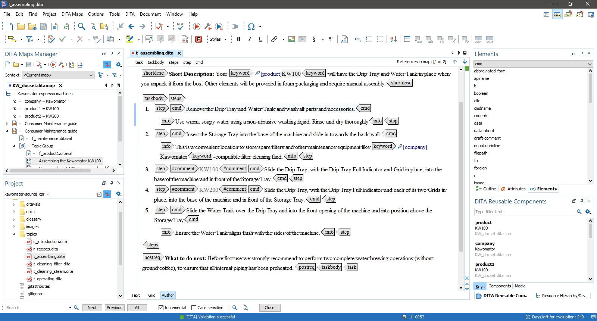

## Standards and practices

### Docs as Code

As the name suggests, Docs as Code is a philosophy of writing documentation in the way software developers write code. This involves using the same tools and working in the same methodologies as programmers. Practices within Docs as Code include:

* Writing documentation in [source code editors](../../05-tools/1-writing-and-text-editing/index.md/#source-code-editors)
* Writing in [plain text](../../05-tools/1-writing-and-text-editing/index.md/#markup-languages) document formats
* Publishing with static site generators (e.g., [Jekyll](../../05-tools/2-content-management-and-publishing/index.md/#static-site-generators))
* Following CI/CD workflow[^1]
* Tracking changes and integrating updates with Version Control Systems (e.g., [Git](../../05-tools/4-facilitating-workflow/index.md/#version-control-systems))
* Using issue-tracking systems (for tracking bugs and fixes; e.g., [Jira](../../05-tools/4-facilitating-workflow/index.md/#project-management))
* Performing Code Review (i.e., programmer's peer review)
* Having documents undergo automated tests (e.g., to check for broken links)
* Working in agile methodologies (e.g., completing tasks in [sprints](../../09-glossary/index.md/#s))

Docs as Code helps to reduce distance between technical writers and developers by bringing writers closer to the code, and programmers closer to the content.  

### Single sourcing

Single sourcing is a practice where the content of a document (the source) is written once and then stored separately from the formatting layer. This allows the content to be published in different output formats all at once, without rewriting any text or adjusting the formatting by hand. 

With tools such as [MadCap Flare](../../05-tools/2-content-management-and-publishing/index.md/#help-authoring-tools) you can write a document and later, with a few clicks, have it formatted through transformation algorithms into a properly-styled PDF document, DOC file, HTML site, you name it. The source file is "raw" content; when exported, it receives an adequate layer of formatting for each type of output and gets published in multiple formats.

In addition, if you need to change something in your documentation, you will edit the source file only, and the content will get automatically updated for all your target outputs.  

### Reuse

Let's say that a small component in a product changes and you have to update the corresponding picture in the documentation. Unfortunately, the same picture is reused in many places, both in the PDF guide and in the online help. It would take ages to copy-paste and replace everything manually.

Instead, you can create a variable that points to the location of your picture, e.g., `d:/docs/images/component.jpg`. This variable is then inserted in the code of your project where needed . All you do now is overwrite `component.jpg` with your new picture and voila! The change will be reflected in every output generated from the code.  

You can do the same with snippets of text: procedures, names, version numbers, or whatever it is that you need to reuse in many places within your project, either in one or across multiple documents.

> ❗ **IMPORTANT:** *Single sourcing* and *reuse* are closely related. To not mix them up, remember the difference:

> * Single sourcing – you write it once and present it in multiple formats.  
> * Reuse – you write it once and reuse it in multiple places.   

### DITA

DITA (Darwin Information Typing Architecture) is a standard for content authoring and information structuring for topic-based documents. It is based on [XML](../../05-tools/1-writing-and-text-editing/index.md/#xml) and specifies sets of tags with concrete attributes and relations between elements (e.g., inheritance)[^2]. Information is divided into types e.g., *Concept* for descriptions or *Task* for instructions.  

DITA can be great for single-sourcing and reuse. XML encapsulates data in tags which are then addressed by transformation scenarios that convert the content to be published in desired formats. Reuse in DITA-structured documents is smooth and flexible thanks to uniform organization of content throughout the project. 

The topic-based architecture encourages the philosophy that [every page is page one](https://idratherbewriting.com/trends/trends-to-follow-or-forget-every-page-is-page-one.html), which means that content within one section should be self-contained enough to be reused in various places without relying on context beyond that section; for example, one shouldn't use discourse markers for continuity, as in: "in the previous section..." or "on the next page...".  

With topics structured this way, DITA uses so-called ditamaps. DITAMAP is a separate file with meta-information for how topics in a DITA-structured document should be organized. A project can be associated with a ditamap to have the topics and the table of contents arranged according to that map. Thus, different maps can be created for the same content to maximize reuse; for each map, you can choose which topics to include and how to arrange them.  

DITA is defined and maintained by [OASIS](https://www.oasis-open.org/). The standard is natively supported by [OxygenXML](https://www.oxygenxml.com/), one of the most popular editors for DITA-structured documents. 

DITA architecture is great for single sourcing and reuse, but some criticize it for its complexity, rigidity, and unnatural fragmentation of content.  

  
*OxygenXML/DITA looks pretty scary when you don't know what you're doing – and doesn't get much better once you do.*  

[^1]: CI/CD (continuous delivery / continuous deployment) is a set of practices where code/content is continuously integrated and deployed automatically from the server every time new changes are committed.   
[^2]: Organizations using DITA are encouraged to expand the architecture to their needs, though.   

---

* Footnotes will be placed here.
{:footnotes}  

---

*Next section: [Tools](../../05-tools/)*