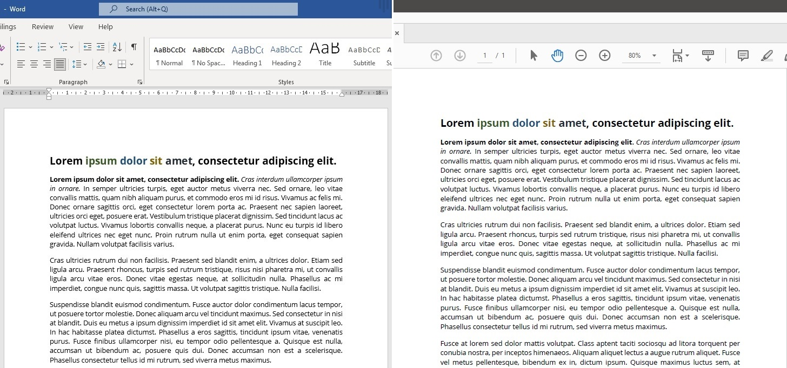
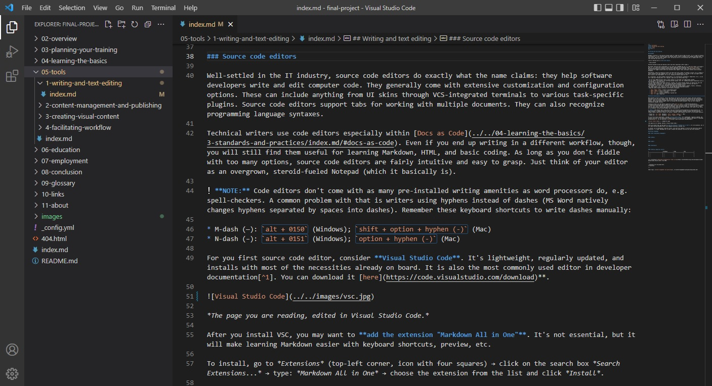
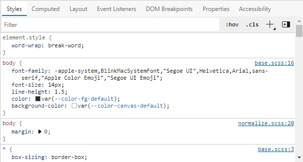
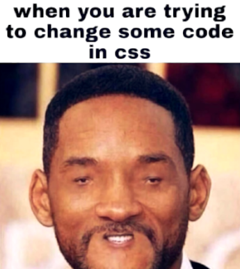
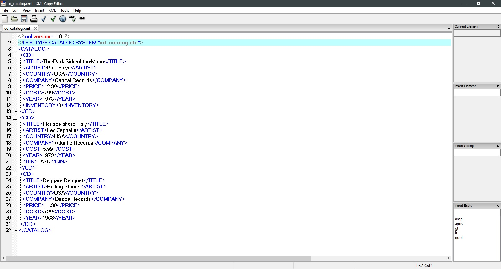

## Writing and text editing

[WYSIWYG⎹](#wysiwyg) [Source code editors⎹](#source-code-editors) [Markup languages](#markup-languages)

### WYSIWYG  

WYSIWYG (/ˈwɪzɪwɪɡ/) – this quirky acronym stands for "What You See Is What You Get". It is a type of software, functionality, or user interface, where the content in the editing view visually resembles the intended output. In other words, the way you see a page in the editor is roughly what it will look like when you print it out.     

Think of editing text in **Microsoft Word**:   

  
*MS Word document during the editing (left) and after exporting to PDF (right).*  

Why bother with [HATs](../2-content-management-and-publishing/index.md/#help-authoring-tools) or [markups](#markup-languages) if you could use a WYSIWYG and call it a day? Put simply: because you don't want to. It is much more flexible to have content separated from formatting (See: [Single sourcing](../../04-learning-the-basics/4-standards-and-practices/index.md/#single-sourcing)). Word is hardly fit for bigger project where you constantly add, update, reuse, and export content across multiple documents.

Nevertheless, there are technical writers out there writing in Word, for better or worse. It is a staple of office software, and some companies still use it for documentation. From time to time, you might see MS Word listed in job requirements. With that said, knowing the basics wouldn't hurt.  

As a translator, you have probably used MS Word or its alternatives (LibreOffice, Google Docs, etc.), so you won't need much training here. As a reminder, make sure you follow these tips:  

* Do not press ENTER multiple times to move content to a new page; use *page break* instead.  
* Do not indent lines manually by inserting multiple spaces; use `TAB` instead and adjust indentation size in the settings, or use *the ruler*.  
* Do not create headers and titles manually; instead, use in-built design layouts (or define your own) and configure them if necessary. This ensures that Word will recognize sections correctly and that all layout-dependent functions (e.g., auto-generated TOCs) will work without errors.  
* In general, try not to insert structure- and formatting-related elements (headers, footers, references, page numbers, etc.) manually if you can add them through dedicated options.  
* Memorize useful keyboard shortcuts (for MS Word on Windows):  

  - `CTRL + SHIFT + SPACE` – insert a non-breaking space  
  - `SHIFT + ENTER` – insert a soft return / line break  
  - `CTRL + ALT + F` – insert a footnote
  - `CTRL + ALT + V` – control formatting of pasted text  
  - `CTRL + K` – add a hyperlink  

### Source code editors  

Well-settled in the IT industry, source code editors do exactly what the name suggests: they help software developers write and edit computer code. They usually come with extensive configuration options. These can include anything from UI skins through VCS-integrated terminals to various task-specific plugins. Source code editors support tabs for working with multiple documents. They can also recognize programming and markup language syntaxes.  

Technical writers use code editors especially within [Docs as Code](../../04-learning-the-basics/3-standards-and-practices/index.md/#docs-as-code). Regardless of your future workflow, though, they will still be useful for learning Markdown, HTML, and basic coding. As long as you don't fiddle with too many options, source code editors are fairly intuitive and easy to grasp. Just think of your editor as an overgrown, steroid-fueled Notepad (which it basically is).  

> 💡 **TIP:** Code editors, unlike word processors, don't come with as many pre-installed amenities (e.g., spell-checkers). As a result, some writers end up using hyphens in place of dashes (Word natively changes space-separated hyphens into dashes). Remember these keyboard shortcuts to write dashes manually:

> * M-dash (—): `alt + 0150` (Windows); `shift + option + hyphen (-)` (Mac)
> * N-dash (–): `alt + 0151` (Windows); `option + hyphen (-)` (Mac)

For you first source code editor, consider [Visual Studio Code](https://code.visualstudio.com/download). It's simple, lightweight, and regularly updated. It is also the most popular editor in developer documentation[^1].    

  
*The page you are reading, edited in Visual Studio Code.*  

After you install VSC, you may want to add the extension *Markdown All in One*. It's not essential, but it will make learning Markdown easier with keyboard shortcuts, preview, etc.  

To install, go to *Extensions* (top-left corner, icon with four squares) → click on the search box *Search Extensions...* → type: *Markdown All in One* → choose the extension from the list and click *Install*.  

### Markup languages

#### Not programming languages

Sometimes, for the uninitiated, any "code", i.e., a string of keyboard symbols other than letters and standard punctuation, looks like a "programming language". I might be preaching to the choir here, but let's make it clear: markups are not programming languages.  

With programming languages, people tell computers to perform tasks; they write algorithmic instructions for computers to execute. Programming languages are used for creating programs.

With markup languages, people tell computers how to present data; they add markup tags to data for computers to interpret. Markup languages are used for formatting and displaying documents.

#### HTML

[HTML](https://www.w3.org/html/) (HyperText Markup Language) is the standard markup language for structuring and displaying web content. It is maintained and documented by the World Wide Web Consortium ([W3C](https://www.w3.org/Consortium/)).  

Documents written in HTML are interpreted by your browser and rendered into websites that you visit every day. HTML elements are building blocks of web content.  

These blocks are like bones in a website's skeleton. They can be "fleshed out" with stylesheet languages ([CSS](https://www.w3schools.com/css/css_intro.asp)) and scripting languages (JavaScript).  

The former provide "the skin", i.e., the presentational layer: layout, colors, fonts, etc. The latter are "the muscles": they make the bones move, i.e., prompt the content to behave in a certain way (e.g., web applications).  

There are also server-side languages ("the brain?"), such as PHP, responsible for the logic behind the website-server communication. This is, of course, a simplification.  

Take a look at this HTML code:  

```html
<!DOCTYPE html>
<html> 
<head>
  <title>My first website!</title>
</head>
<body>
  <h1>This is a heading.</h1>
  <p>This is a paragraph</p>
</body>
</html>
```

You can actually paste it into Notepad, save as "YourFile.html", and open the file in your browser. This is a *legit* web document.  

* `<!DOCTYPE>` specifies the document type.
* `<head>` includes various metadata (e.g., page title, links to stylesheet files, etc.).
* `<body>` is the actual content you see in the browser.
* `<h1>` is a header.
* `<p>` is a paragraph.

You will find the full list of HTML elements [here](https://www.w3schools.com/tags/default.asp). 

Your browser should let you peek into the HTML and CSS of a website. Try one of these while browsing:  

* Click `CTRL + U`.
* Click `Right Mouse Button` and select `Inspect`.  

You will also see *Styles* in there:  

  

This is the aforementioned CSS (Cascading Style Sheets), which usually does not appear in the HTML code, as it is linked to the page from an external stylesheet file. In web design, this is similar to [single sourcing](../../04-learning-the-basics/4-standards-and-practices/index.md/#single-sourcing), in that you separate the content from its formatting.  

  
*If you don't get this meme yet – you Will.* | Image source: [I am Programmer, I have no life](https://www.facebook.com/ProgrammersCreateLife/posts/3851563691559147?locale2=sw_KE&_rdr)  

#### Markdown

OK, so WYSIWYG is not cool, code editors look very *technical*, and online documentation is the future (and present). Does this mean that from now on you should wrap your paragraphs `<p>like this</p>`, and put `<br>` at the end of each line? No way, programmers are [too lazy](https://thethreevirtues.com/) for that – and they come to the rescue if you are too.    

In 2004, John Gruber and Aaron Swartz created [Markdown](https://daringfireball.net/projects/markdown/) – a lightweight markup that is both easy to write in and pleasant to read. See for yourself:

```markdown
# This is a header.
**This is a bold text,** *and this is in italics.*
Here comes a footnote[^1],  
and line breaks are recognized as long as you put two spaces at the end.  
## This is a smaller header.
This is a list:
  * first item
  * second item

[^1]: This is the footnote from earlier.
```

and the floor is lava.  

No, seriously, you don't have to imagine the formatting: the page you're reading was written in Markdown. Still, the unprocessed text isn't too bad, right?  

Apps and websites that support Markdown use special processors that transform Markdown to HTML (this is why you won't see it under `CTRL + U`). Thus, `# ...` becomes `<h1>...</h1>`, `**...**` becomes `<strong>...</strong>`, and so on.  

Markdown files have the extension `.md`. The range of tags is limited, which has its pros: you will learn pretty much all of Markdown in a heartbeat. Find all you need at [Markdown Guide](https://www.markdownguide.org/).  

> ❗ **IMPORTANT:** Markdown comes in various *flavors*; different apps and websites render it differently, so expect that your final output may vary from what you saw in your VSC preview.  

#### XML

[XML](https://www.w3.org/XML/) (Extensible Markup Language) is a markup language that is used for storing, processing, and reconstructing data.  

Unlike in HTML and Markdown, tags in XML are not predefined. Instead, you define your own tags, much in a way you will define classes in HTML/CSS. You then "tell" the computer what are the tags that you have defined; this is done via [XML schema](https://en.wikipedia.org/wiki/XML_schema) or DTD files (used in the past, not common any more).  

  
*XML content written in free [XML Copy Editor](https://xml-copy-editor.sourceforge.io/).*  

This unlimited *expresiveness* of XML is what sets it apart; in theory, you can describe anything with XML tags, and however you like.  

XML content is meant to be processed by software to produce various results. It's great for separating content from formatting: you write it once and then instruct your publishing tool to transform it to various outputs (*[Single sourcing](../../04-learning-the-basics/4-standards-and-practices/index.md/#single-sourcing)*).

The problem with XML is that you will eventually have to learn some standard to follow (e.g., [DITA](../../04-learning-the-basics/4-standards-and-practices/index.md/#dita)), and that for bigger projects you might need paid tools such as [Oxygen XML](https://www.oxygenxml.com/) or [Adobe FrameMaker](https://www.adobe.com/products/framemaker.html).

#### Markup comparison table

|                  | Markdown           | HTML                   | XML                            |
|------------------|--------------------|------------------------|--------------------------------|
| Role in content  | Writing plain text | Publishing web content | Describing and storing content |
| Predefined tags  | Yes                | Yes                    | No                             |
| Why bother?      | Docs as Code       | Online documentation   | DITA                           |  

[^1]: According to [Developer Documentation Trends survey](https://idratherbewriting.com/learnapidoc/slides/devdoctrends_results.html) from 2020.  

---

* Footnotes will be placed here.
{:footnotes}  

---

*Next topic: [Content management and publishing](../2-content-management-and-publishing/index.md)*
