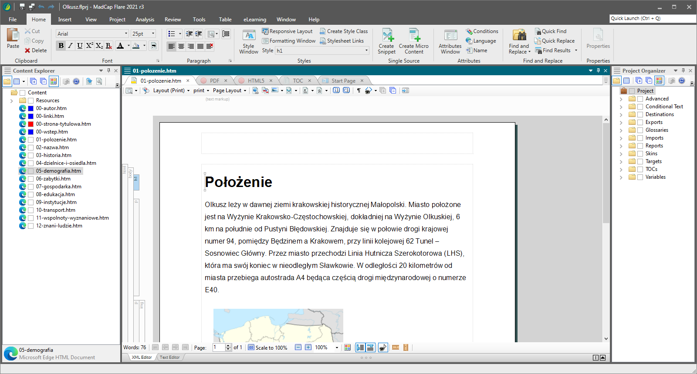

## Content management and publishing

[Content Management Systems⎹](#content-management-systems) [Help Authoring Tools⎹](#help-authoring-tools) [Static site generators](#static-site-generators)

### Content Management Systems

Content management systems (CMS) are software solutions for managing digital content; they typically allow users to manage content at a document level. They provide writers with a uniform platform to handle content all in one place: from creation to deployment.  

Closely related are Component content management systems (CCMS); these, in turn, allow for managing content at a component level. The difference is thus in the scope, or in how specific you can be with the elements you address.

CMS provides an entire eco-system for your documentation: you probably won't need any other tools for handling your documents if your company uses a CMS.  

In the CMS, apart from creating the content, you can also exchange comments and fulfil other aspects of the earlier phases of documentation development, such as planning and research.

A very popular CMS (or CCMS, actually) used by technical writers, is [Heretto](https://heretto.com/). Heretto has in-built functions for handling [single sourcing](../../04-learning-the-basics/4-standards-and-practices/index.md/#single-sourcing) and [reuse](../../04-learning-the-basics/4-standards-and-practices/index.md/#reuse) of content, as well as many other functionalities, e.g., for management and communication within the organization.

Atlassian's [Confluence](https://www.atlassian.com/software/confluence), a web-based corporate wiki, is another tool that can be successfully used as a CMS. Although technically an ECM (Enterprise Content Management) and collaboration software, it's well-organized and efficient enough for document management and page publishing. If you decide to study technical communication at [Vistula](../../06-education/5-degrees/index.md/#technical-communication-at-university), you will have access to Confluence for a whole year – more than enough to get an idea of what a CMS might feel like.  

### Help Authoring Tools

Help Authoring Tools (HAT) are a type of content management systems designed specifically for creating and publishing documentation. Perhaps the most popular HAT on the market right now is [MadCap Flare](https://www.madcapsoftware.com/products/flare/).  

HATs are especially useful for bigger documentation projects, particularly those that publish [online help](../../04-learning-the-basics/1-types-of-deliverables/index.md/#product-documentation) together with outputs in printable formats (mostly PDF). For such cases, HATs have in-built functionalities that handle [single sourcing](../../04-learning-the-basics/4-standards-and-practices/index.md/#single-sourcing) and [reuse](../../04-learning-the-basics/4-standards-and-practices/index.md/#reuse) of content in a possibly painless manner.  

HATs thus generally support the topic-based approach to documents (similarly to [DITA](../../04-learning-the-basics/4-standards-and-practices/index.md/#dita)). Other functionalities may include a [WYSIWYG](../../05-tools/1-writing-and-text-editing/index.md/#wysiwyg)-like editing mode, simple image editors, automatically-generated structure elements for documents (e.g., tables of contents), spelling checkers, and more. They also support importing and exporting of many various file formats.  

*A project edited in MadCap Flare.*

In general, HATs are paid tools, and they can get quite expensive. As a beginner, you don't need to learn any of them particularly well, though. Remember that it is not economical to [learn in advance](../../03-planning-your-training/2-what-you-need-to-learn/index.md/#you-are-gonna-learn-it) things you might end up never using again. With HATs it is precisely this case: usually when a company uses a HAT, their entire workflow is dictated under this tool – and when they don't... well, then they just don't, and you will never need it as long as you work for them.  

### Static site generators

Static site generators are software tools designed for generating static HTML websites. They are used for rapid deployment of simple web projects.  

In general, when you write documentation e.g., within the Docs as Code approach, you are not going to set up an entire website from square one: with hosting, HTML formatting, stylesheets, scripts, and all of that. Instead, you will use a static site generator to quickly deploy the page and focus on the content rather than lower-level technicalities.  

Two common static site generators worth mentioning, in my opinion, are:

* [Jekyll](https://jekyllrb.com/)  
* [Docusaurus](https://docusaurus.io/)  

Jekyll is natively supported by GitHub Pages, which we will discuss later when we cover the publishing of your [Portfolio](../../07-employment/1-portfolio/index.md/#how-to-publish-your-portfolio-on-github-pages).  

Static site generators generally have a simple syntax designed towards implementation of the most common functionalities that you, the user, could think of when deploying a page. A lot of these funtionalities are turned on or off by simple *true/false* statements in special configuration files.  

---

*Next topic: [Creating visual content](../3-creating-visual-content/)*
