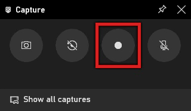
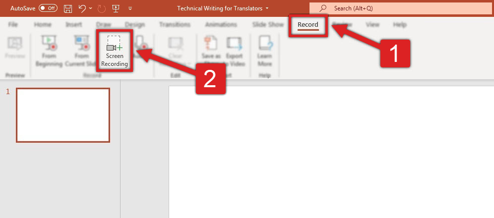

## Creating visual content

[Tools you already have⎹](#tools-you-already-have) [Software for professionals](#software-for-professionals)

### Tools you already have

> ❝*Software is like sex: it's better when it's free.*❞   
> — [Linus Torvalds](https://twitter.com/linus__torvalds/status/296333253571387392?lang=en)

Jokes aside, software can be expensive, and you are not retraining as a graphic designer. At most, you should be able to create and edit simple visual content to be used in documentation (e.g., in your portfolio): screenshots, screen recordings, or basic diagrams. For your current purposes, free tools should be enough.  

> 💡 **TIP:** Most paid tools offer time-limited trial license of up to 15 or 30 days; plan this time wisely and you might have working knowledge of a tool right before an interview.  

#### Screenshots

For screenshots, you can use utilities built into your system. *Snip & Sketch* in Windows (formerly: *Snipping Tool*) lets you select a portion of screen to capture and then edit your result. You can add simple annotations and highlight important points with a pen tool.  

Alternatively, you could just press the `Print Screen` on your keyboard, and `CTRL + V` the screenshot into Paint. Remember: *If it works, it's not stupid!*

#### Screen recording

If you are on Windows, you can record the screen with an in-built tool for gamers. 

Simply open a program you would like to record (e.g., your browser) and press `Windows Key + G`. On the interface that pops up, click the "recording" icon:

  

Click it again once finished to save the recording. 

This way you can quickly create a simple instructional video, e.g., on how to perform a task in some software.

> ❗ **IMPORTANT:** This function will not work in every program.

Surprisingly, [Microsoft PowerPoint](https://www.microsoft.com/en-gb/microsoft-365/powerpoint) (not free, but you might have it as MS Office user) has a screen-recording functionality too. You will find it under *Record* tab:

  

Click it, and from there you'll be guided by Microsoft's on-screen instructions.

To finish recording, move your mouse to the top of the screen and click the square button.

The recording will show as video frame in your current slide. Right-click it and select *Save Media as...* to export to a location of your choice.  

Of course, do learn other functions of PowerPoint if you have a chance. Presentations are among technical deliverables, and making good ones is a valuable skill.  

#### Graphics editing

For more sophisticated tasks, use [GIMP](https://www.gimp.org/). It's essentially "the free Photoshop". There are even [guides](https://www.youtube.com/watch?v=dY7g2JGyJeQ) on how to make it look and work more like Adobe. With GIMP, you should learn how to work with layers, explore various file formats, filters, color attributes, etc.

#### Diagrams and flowcharts

For diagrams and flowcharts, try [diagrams.net](https://app.diagrams.net/) (formerly draw.io). It's easy to use and works in the browser. It features elements of UML and BPMN, and exports projects to various formats (including SVG). It can also generate markups for your graphics to be embedded straight to HTML.  

### Software for professionals

Paid tools come with more possibilities, and for companies the investment is usually justified. Popular graphic tools in tech comm include:

* Screen capturing: [Snagit](https://www.techsmith.com/screen-capture.html).
* Screen recording / video editing: [Camtasia](https://www.techsmith.com/video-editor.html).
* Graphic design / editing (raster): [Adobe Photoshop](https://www.adobe.com/products/photoshop.html).
* Graphic design / editing (vector): [Adobe Illustrator](https://www.adobe.com/pl/products/illustrator.html).
* Diagrams and flowcharts: [Microsoft Visio](https://www.microsoft.com/pl-pl/microsoft-365/visio/flowchart-software?rtc=1), [Lucidchart](https://www.lucidchart.com/), [draw.io](https://drawio-app.com/).
* Presentations: [Microsoft PowerPoint](https://www.microsoft.com/en-gb/microsoft-365/powerpoint), [Prezi](https://prezi.com/).
* Content design / prototyping: [Figma](https://www.figma.com/).

> 🖊️ **NOTE:** Some of these programs have paid subscription plans, but offer basic functionality for free.

---

*Next topic: [Facilitating workflow](../4-facilitating-workflow/)*