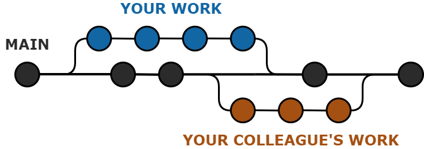
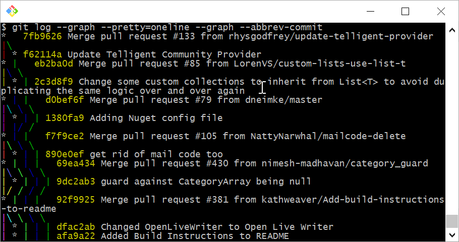
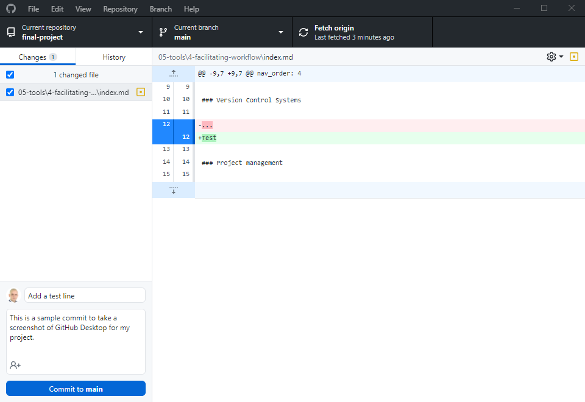
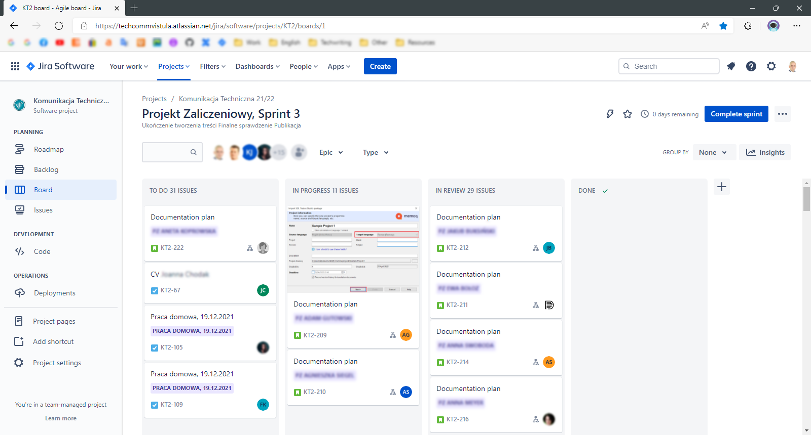

## Facilitating workflow

### Version Control Systems

Version Control Systems (VCS) are systems designed for tracking and controlling changes in software source code – though not only! You can just as well use them to track changes in any other type of content within your documentation.  

They also provide the functionality of *branches*, i.e., developers can work independently on various aspects of the software, e.g., you might be implementing one feature, and your colleague, at the same time, might be working on something else. Then, both of you *commit* (send to the server) your work progress and *merge* it into the main branch for the project; thus, your work is aligned and integrated into the product. In case there are *conflicts* between your contributions, you will solve them manually (just don't solve other conflicts with your colleagues *manually* as well ☺).  

  
*A simplified representation of Git workflow.* 

VCS also provide a varying degree of protection against accidental data loss (or against a modification that you realized you'd rather *not* have commited ☺): because the server (and, in DVCS, any node in the system; read on!) contains a working copy of the code to which, theoretically, you can revert whenever things go south.  

Colloquially, any version control system can be referred to as *VCS*, but – to be exact – there are certain types and differences to consider.  

Originally, VCS were only *centralized* (CVCS). This meant that you – the so-called *client* – had to communicate with a remote *server* for each of your *commands* (e.g., *commit*, *merge*, etc.), which took a while.  

Then, Distributed Version Control System (DVCS) were introduced; these don't rely on a central server; instead, every contributor to a project has an inependent repository with a full history of changes. This allows for faster communication with the main repository, adds the possibility of offline work (as you have a copy of the repository on your local machine), and increases the protection of data (with more copies of the main repository, than just a single central one).  

*A comparison between CVCS and DVCS.* | Image source: [GeeksforGeeks](https://www.geeksforgeeks.org/centralized-vs-distributed-version-control-which-one-should-we-choose/)

The most popular DVCS nowadays is [Git](https://git-scm.com), created in 2005 by Linus Torvalds (that guy of Linux). This is also the VCS you are most likely going [to learn](../../06-education/3-online-courses/index.md/#free-recommendations).  

By default, you are supposed to use a command line interface to communicate with Git. However intimidating it might seem, do spend some time (maybe take some courses) to understand it. There are many functions of Git that work only through this interface; plus, you will gain an in-depth understanding of what is actually happening under the hood when you make a *commit*.  

  
*Git command line looks scary, but may be worth learning.* | Image source: [Sara Ford's Blog](https://saraford.net/2017/03/17/how-to-view-a-git-log-graph-from-the-command-line-that-looks-like-visual-studio-view-history-076/)  

Other than that, you can just as well use a more friendly, graphic user interface, such as the one provided by [GitHub](../../09-glossary/index.md/#g):

*Phew... Now THIS looks much more approachable, thanks.*

It is *crucial* for you as a beginner in tech writing to at least get the very basics of Git (preferably; or other VCS) down. You might need it not only for the [Docs as Code](../../04-learning-the-basics/4-standards-and-practices/index.md/#docs-as-code) approach!  

**Tips for beginners:**

* Consider [learning Git](../../06-education/3-online-courses/index.md/#free-recommendations) in depth (including command line).
* Write clear and short commit messages (and descriptions, optionally).
* Write using [imperatives](https://www.theserverside.com/video/Follow-these-git-commit-message-guidelines), e.g., *"Add new buttons"* instead of *"Adding new buttons"*.
* Mind the difference between main repositories and [forks](https://docs.github.com/en/get-started/quickstart/fork-a-repo).
* Save your work often and commit regularly (a few times a day).

> 💡 **TIP:** Don't get too caught up in following these tips. You should learn good habits, but always focus on the content first. Perfection is not always possible; for example, with GitHub Pages (if you don't set up [Jekyll](../2-content-management-and-publishing/index.md/#static-site-generators) environment locally), you will probably commit much too often and with default messages, just to see the results on your page – and that's OK.  

### Project management

Technical writers may also use various software to facilitate project management; these are usually solutions adopted globally (i.e., *by everybody* ☺) in a company – and they will vary.  

An example of such software is Atlassian's [Jira](https://www.atlassian.com/software/jira):

  
*[Agile](../../09-glossary/index.md/#a) project management in Jira.*

Although originally intended as a bug tracking system only, it quickly developed and today encompasses a lot more functions within broadly defined project management.  

In the screenshot below, you can see the main screen of a project in Jira: the current [sprint](../../09-glossary/index.md/#s) with divided columns for tasks *"to do"*, *"in progress"*, *"in review"*, and so on. Apart from the ability to grab and move the tasks across the columns, you can also link issues, add descriptions, and a lot more.  

There are many other tools for project management out there, and we are not going to list them here. Just do know that they exist, and their purpose is to facilitate workflow without a given *methodology* (e.g., aforementioned Agile). Which tool you will use will depend on your company and their adopted methodology.   

---

*Next section: [Education](../../06-education/)*