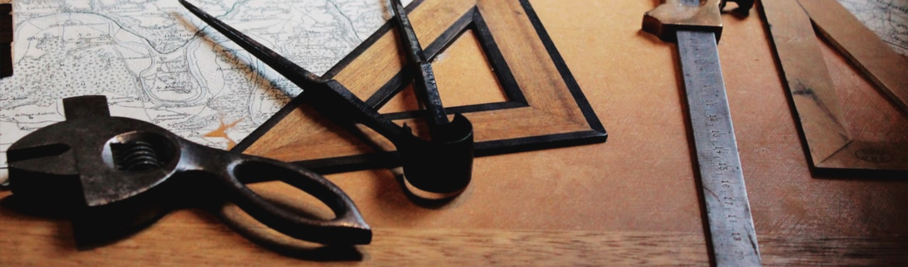

# Tools

This section covers the variety of tools technical writers utilize in everyday work. Make no mistake, though – this is not a tutorial. You can't learn a craft without putting in hours of practice. You can, however, get a general idea of what there actually is to practice. Once you go through the topics, you will be familiar with different types of software and technologies in technical writer's arsenal.
