## Portfolio

[What to include?⎹](#what-to-include) [Where to publish?⎹](#where-to-publish) [How to publish your portfolio on GitHub Pages](#how-to-publish-your-portfolio-on-github-pages)

### What to include?

Anything that makes you proud and attests to your skills, for example:

* Manuals, tutorials, and other documentation projects
* Non-technical texts on field-related topics (articles, reviews)
* Graphic design projects (infographics, diagrams)
* Content created with different tools
* Content published in different formats
* Open-source contributions

### Where to publish?

Attaching projects to emails can be awkward, if not impossible (file size limits). Ideally, you should collect all your works in one place and publish them online. Then, you could simply include the link on your resume.

First, you will need a hosting service to upload your resources. If you have a blog or a website where you can store and share your files – and you know how to – that's one option. If you'd rather follow a simple method with few technicalities – read on.

### How to publish your portfolio on GitHub Pages  

GitHub is a cloud-based development platform that provides repository hosting services and user interface for [Git](../../05-tools/4-facilitating-workflow/index.md/#version-control-systems). For many IT specialists, it is also the default go-to service for showcasing their projects to the world.  

In this tutorial, you will learn how to publish your portfolio on GitHub. You will first upload your files to the server and then deploy your projects as fully-working websites hosted on [GitHub Pages](https://docs.github.com/en/pages/getting-started-with-github-pages/about-github-pages).  

When you publish your portfolio on GitHub, your recruiters will see the end result of your work as well as the code behind your projects. You will also show that you know about version control systems and static site generators.  
  
**PREREQUISITES:**

   * Basic knowledge of [Git](../../05-tools/4-facilitating-workflow/index.md/#version-control-systems), [GitHub](../../05-tools/4-facilitating-workflow/index.md/#version-control-systems), and [static site generators](../../05-tools/2-content-management-and-publishing/index.md/#static-site-generators).
   * At least one valid document in a web format: [HTML](../../05-tools/1-writing-and-text-editing/index.md/#html) or [Markdown](../../05-tools/1-writing-and-text-editing/index.md/#markdown).
   * A user account set up on [GitHub](https://github.com/).
   * [GitHub Desktop](https://desktop.github.com/) installed on your computer.

#### Creating a GitHub repository

1. Sign in to your account at [github.com](https://github.com/).  
2. Next to **Recent repositories** click **New**.

    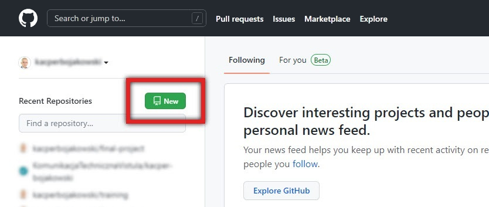

3. Write your repository name and make sure it's set to **Public**.

    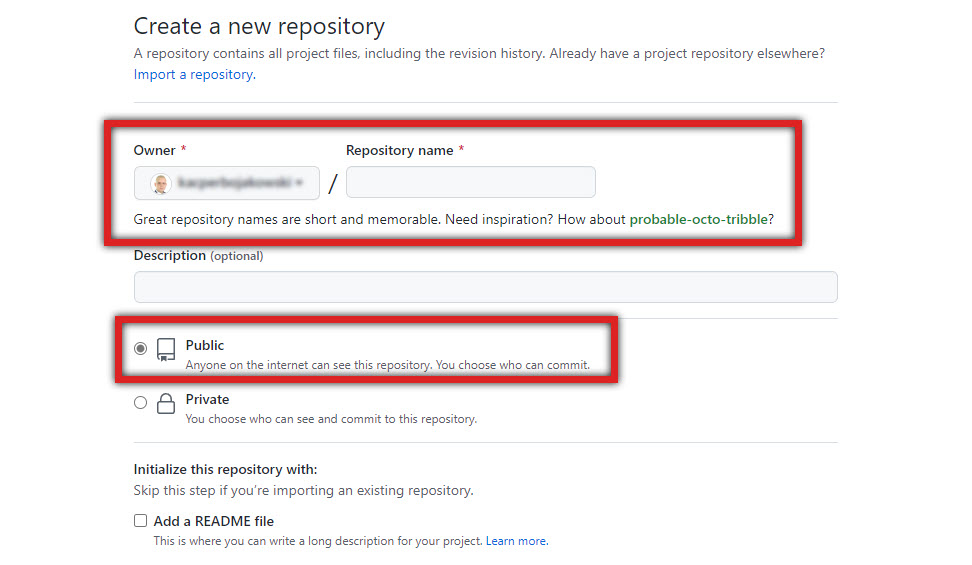

4. Click **Create repository** at the bottom.  

    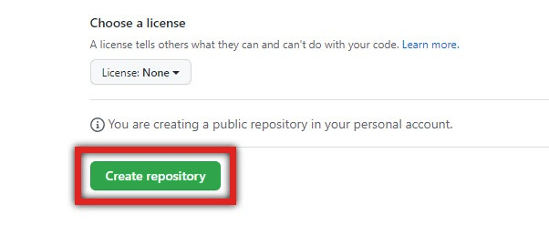

#### Adding files to the repository

1. Rename your document as *"index"*, so that your file is `index.md` (for Markdown) or `index.html` (for HTML).
2. Open GitHub Desktop.
3. Click **Current repository**.

    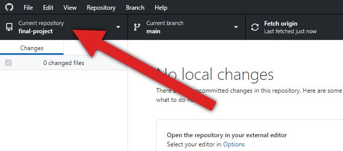

4. Click **Add** and choose **Clone repository...**.

    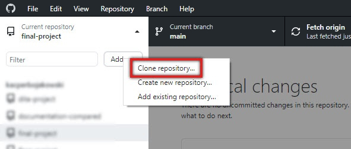

5. Find the repository you created earlier, select it, and click **Clone**.

    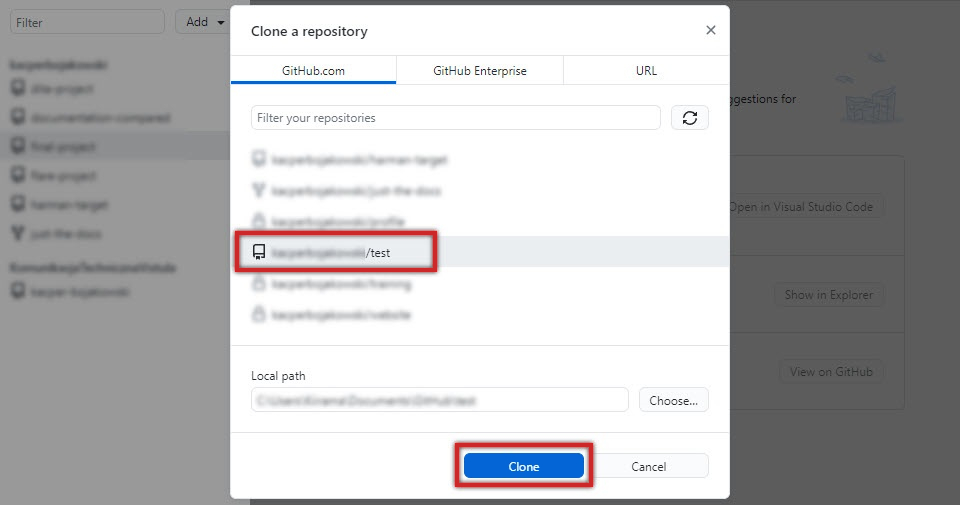

6. Click **Show in Explorer** to view the local folder for your repository.

    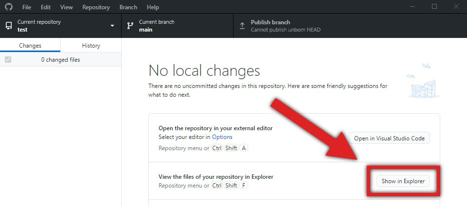

7. Copy your document and paste it in this folder.
8. Go back to the GitHub Desktop window and click **Commit to main**.

    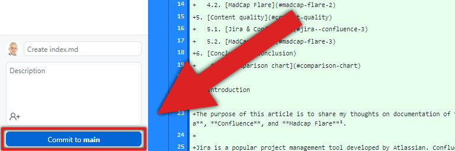

9. Click **Publish this branch**.

    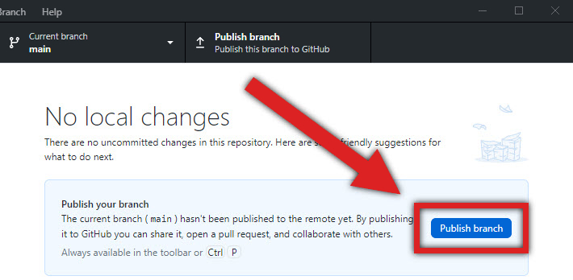

10. Open your browser, go to your account on [github.com](https://github.com/), and check your repository. It should already contain the file you added.

    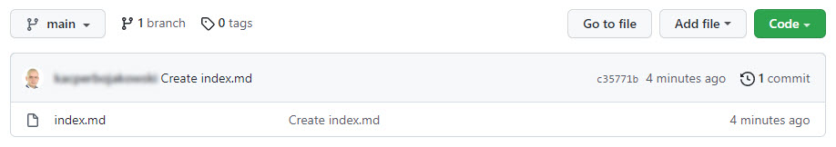

#### Publishing on GitHub Pages

1. On your repository page, click **Settings**.

    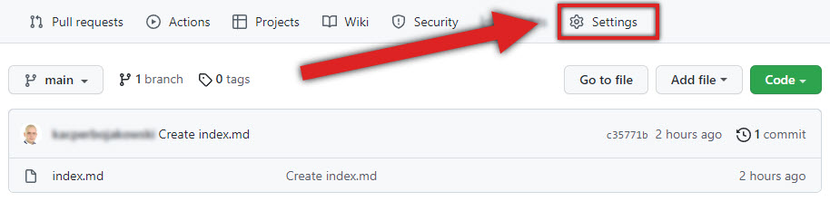

2. Go to **Pages** and find the **Source** tab.
3. Click **None** and change it to branch **main**.
   
    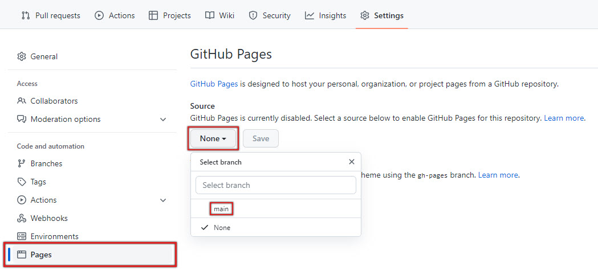

4. Click **Save**. 

    You will see the information that your page is ready to be published:

    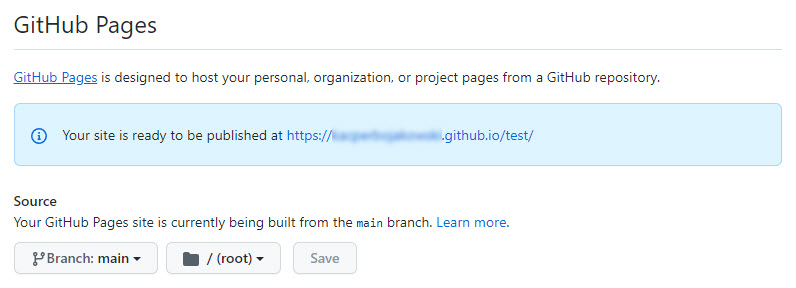

    This is the address of your project published on GitHub Pages.  

    You won't be able to view it right away. It will take some time until the link actually works.   

    Your page will go through three stages, each represented by one of these icons respectively:

    

5. Click **github-pages** under the **Environments** tab on your repository page. If you don't see it, wait a few minutes and refresh the page.  

    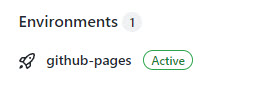

6. Once your page is *Active*, click **View deployment** to see it.  

    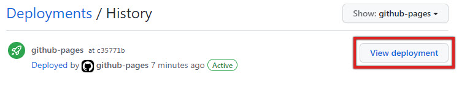

#### Organizing your portfolio

**Pin your repository**  

1. Go to [github.com](https://github.com/) and sign in.
2. Click your avatar in the top-right corner and select **Your profile**.
3. Click **Customize your pins**.
4. Choose the repository you want to pin. You can have a maximum of 6 pinned repositories on your profile page.

**Add the link and description**  

1. Open your repository page.
2. Next to **About**, click the cog icon. 
3. In the **Description** field, add a description of your project; it will appear together with your pinned repository on your profile page.
4. In the **Website** field, add the address of your project published on GitHub Pages.  

**Done!**  

That's it! Now you can share your GitHub portfolio. The address is `https://github.com/` followed by your user name, e.g., `https://github.com/john-smith/`. 

> 🖊️ **NOTE:** There are more ways to add your project to GitHub, for example via file upload on the GitHub website or through Git command line interface. The method described here is just very universal; it is a middle ground between difficulty and ability to conveniently add multiple files at once.  

#### Troubleshooting

**I renamed my file to "index.md"/"index.html", but it doesn't save with the new extension.**  

Indeed, when you rename, for example, a TXT file to "index.md", you might simply end up with a TXT file named "index.md", as in `index.md.txt`. To make sure there are no problems, save your document via Visual Studio Code. Open your file in VSC, and then click *File* → *Save As...* and choose the right extension under *Save as type*.  

**I don't see options for setting *source* under *Settings → Pages.***

Make sure your repository is set to *Public* and not *Private*. Go to: *Settings* → scroll all the way down → *Danger Zone* tab → click *Change visibility*; accept your change, go back to *Pages*, and see if the option appears.  

**I made changes in my project but they don't show on my *Page*.**

Wait a few more minutes and refresh the page. Pages can take a while to update. Sometimes you may need to restart your browser or delete it's [temporary files](https://www.crucial.com/articles/pc-users/how-to-delete-temporary-internet-files). Also, make sure that you have *commited* and *pushed* your changes in GitHub Desktop.  

**Can I include non-web formats, such as PDF documents, in my portfolio ?**

Absolutely! To have PDF documents show up on a GitHub Page, place them in the same repository as your page and refer to them via Markdown's relative-path links, e.g., `[My PDF](myfile.pdf)`.  

---

*Next topic: [Resume](../2-resume/)*
