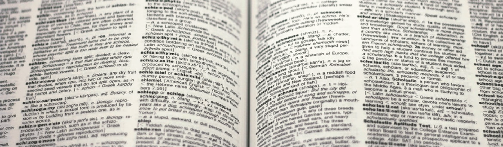

# Glossary

Here is a list of various technical terms and abbreviations (in parentheses) that appeared in this guide, in alphabetical order.

###### [A](#a) [B](#b) [C](#c) [D](#d) [E](#e) [F](#f) [G](#g) [H](#h) [I](#i) [J](#i) [K](#k) [L](#l) [M](#m) [N](#n) [O](#o) [P](#p) [Q](#q) [R](#r) [S](#s) [T](#t) [U](#u) [V](#v) [W](#w) [X](#x) [Y](#y) [Z](#z)  

###### A

**Absolute path** – a path that leads to a file or a folder using its full directory address, e.g., `C:\Program Files\GIMP 2\bin\gimp-2.10.exe`; used in websites and operating systems. | *See also: [Relative path](#r)* |  

**Admonitions** – specially marked (usually with icons, indentations, etc.) blocks of content that provides users with additional information (e.g., *"❕ NOTE: ..."*), give them a warning, draw their attention to something important, etc. |  

**Agile** – an iterative approach in software development and project management that emphasizes adaptability, continuous improvement, and incremental delivery of a product; flexible, good for software; includes various methodologies and practices, such as [Scrum](#s). |  

**Application programming interface (API)** – a software intermediary for developers that allows for communication between two programs. | *See also: [Endpoint](#e)*  

###### B  

**Breadcrumbs** – a type of navigation scheme in the form of textual elements that raise users' awareness of their current location in a web document; for example topic hierarchy markers and prompts such as *"Home > Chapter 1 > Introduction"*, *"Next topic"* or *"You are here!"*. |  

###### C

**Content management system (CMS)** – software for managing digital content; it typically allows users to manage content at a document level. | *See also: [CCMS](#c) |  

**Component content management system (CCMS)** – a [content management system](#c) that allows for managing content at a component level. | *See also: [CMS](#c) |  

**Cascading Style Sheets (CSS)** – a style sheet language that provides presentational elements to an [HTML](#h) content; it is responsible for the looks of a web page. |  

###### D

**Distributed Version Control System (DVCS)** – a [version control system](#v) which doesn't rely on a central server; instead, every contributor to a project has an independent repository with a full history of changes. |  

**Docs as Code** – a philosophy of writing documentation in the way software developers write code, i.e., using code editors, [version control systems](#v), [static site generators](#s), etc. |  

###### E

**Endpoint** – in [API](#a), a point at which two programs can communicate with each other; the code that allows developers to make two programs communicate. |  

###### F

###### G

**Git** – a very popular open-source distributed version control system [DVCS](#d). |  

**GitHub** – a cloud-based development platform that provides repository hosting services and user interface for [Git](#g). |  

###### H

**Help Authoring Tool (HAT)** – a type of content management system ([CMS](#c) designed specifically for creation and publishing of documentation; for example: [MadCap Flare](https://www.madcapsoftware.com/products/flare/). |  

**High-level operation** – any operation that concerns more general functioning of a system; requires less technical knowledge than [low-level operations](#l). |  

**HTML** – a [markup language](#m) (also: a file format) used for structuring the content of a website; a standard for displaying documents in a web browser. |

###### I

**Input** – any material required for processing to produce the [output](#o). |  

###### J

**Jekyll** – a very popular [static site generator](#s). |  

###### K 

###### L

**Low-level operation** – any operation that concerns more specific elements of a system; requires deeper technical knowledge than [high-level operations](#h). |  

###### M

**Markdown** – a [markup language](#m) with simple tags that allow for quick and easy formatting of text; used especially in web writing; converts to HTML. |  

**Markup language** – a computer language with tags that can be interpreted by software as instructions to format or otherwise transform the encoded text. |  

###### N 

###### O

**Open-source software** – software which anybody can modify and contribute to; a source code that is open to and maintained by the public. |  

**Output** – the end-result achieved through the processing of [input](#i). |  

###### P

**Persona** – in content design, a fictional profile with features that represent some key characteristics (e.g., level of knowledge, social group, age) of the target audience. |  

**Plain English** – a subset of English that is easy to understand, with simple vocabulary and grammar. |  

###### Q 

###### R

**Raster graphics** – a type of computer graphics where the image is represented as a grid of pixels; example: JPG. | *See also: [Vector graphics](#v)*  

**Relative path** – a path that leads to a file or a folder and uses the current location as a starting point, e.g., `../images/avatar.jpg`. | *See also: [Absolute path](#a)*  

**Reuse** – a practice where a piece of content is written once and then reused many times, e.g., as snippets. |  

###### S

**Scrum** – an [agile](#a) methodology in project management, for teams of <9 people, where products (mainly software) are updated and released in [sprints](#s) of <1 month. | *See also: [Waterfall](#w)*  

**Simplified Technical English (STE)** – a controlled language created to provide better clarity and less ambiguity in technical texts; has very specific rules regarding grammar and vocabulary. |  

**Single sourcing** – a practice where a document is written once and then presented in multiple output formats. |  

**Source code editor** – text-editing software for writing computer code, e.g., VSC. |   

**Sprint** – a time-boxed period of work with a set number of tasks to complete; used in [agile](#a) methodologies such as [Scrum](#s). |  

**Static site generator** – a tool for generating static HTML websites; used for rapid deployment of simple web projects. |  

**Subject-matter expert (SME)** – a person with a deep understanding of a particular area; an authority to refer to for expertise in a project. |  

###### T

###### U

**Usability** – a degree of efficiency, simplicity, and satisfaction with which a product can be used to achieve its intended purpose. |  

**User experience (UX)** – all aspects regarding a user's experience with a product or a service; user experience design focuses on how the user interacts with a product and how this interaction can be made more intuitive, efficient, and satisfactory. | *See also: [Usability](#u)* |  

**User story** – in [agile](#a) software development and management, a short description of how a user would interact with a product and for what purposes; it helps asses the product's requirements. |  

###### V

**Validity** – a document written in a [markup language](#m) is valid when its syntax and structure follow the rules of that language, e.g., tags are closed and properly nested, correct attributes are used, etc. In XML, easy to confuse with [well-formedness](#w). |  

**Vector graphics** – a type of computer graphics where the image is drawn by a computer along specified coordinates, according to a set of commands and mathematical statements. This allows for scaling of the image without loss in resolution, as the graphics are rendered from the code and not stored as a fixed map of pixels; example: SVG. | *See also: [Raster graphics](#r)*  

**Version Control System (VCS)** – a system for tracking and controlling changes in software source code. |  

###### W

**Waterfall** – in project management, a linear methodology where a product is released "all at once" after all phases of development are completed; inflexible, better for hardware. | *See also: [Scrum](#s)*  

**Well-formedness** – an [XML](#x) document is well-formed when its syntax and structure follow the rules specified by [W3C](https://www.w3resource.com/xml/well-formed.php#:~:text=An%20XML%20document%20is%20called,XML%20document%20must%20be%20proper.); in this context, it's different from [validity](#v) – conformance to rules specified in the document's meta files ([Read more](https://www.informit.com/articles/article.aspx?p=24992&seqNum=8#:~:text=The%20difference%20between%20well%2Dformed%20and%20valid%20XML%20is%20simple,valid%2C%20although%20it%20may%20be.)). |  

**What You See Is What You Get (WYSIWYG)** – a type of software, functionality, or user interface where the edited content visually resembles the intended finished output. |    

###### X

**Extensible Markup Language (XML)** – a [markup language](#m) (also: a file format) with non-predefined tags; used for storing, processing, or reconstructing data in different programs and formats; both human- and machine-readable. |

###### Y

**You Aren't Gonna Need It (YAGNI)** – in software development, a principle whereby new functionalities are added to the product only when absolutely necessary. |  

###### Z

---

*Next section: [Links](../10-links/)*
